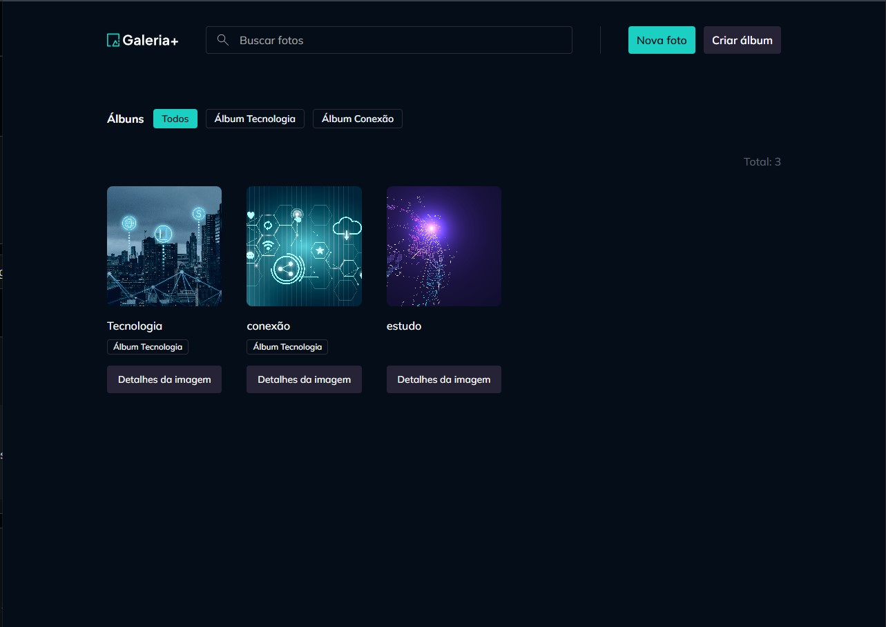
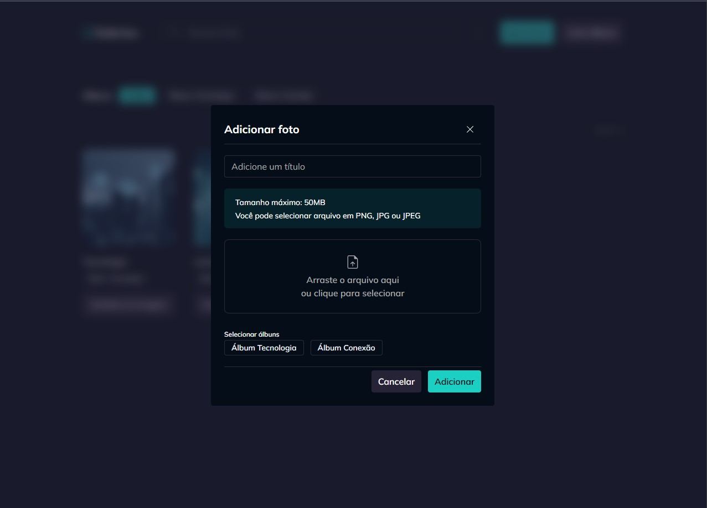

# Gallery Plus

# 📸 Galeria+ | Rocketseat Study Project

<p align="center">
  
  
  
  
</p>

---

## 📸 Demonstração da Aplicação

<p align="center">
  
  
</p>

## 💻 Sobre o Projeto

O **Galeria+** é uma aplicação de gerenciamento e visualização de fotos desenvolvida como um projeto de estudo aprofundado em **ReactJS** através da plataforma **Rocketseat**. 

A aplicação simula um ecossistema real de upload, listagem dinâmica e categorização de imagens por álbuns, focando em boas práticas de componentização, gerenciamento de estado e consumo de APIs assíncronas.

## 🚀 Tecnologias Utilizadas

O projeto foi construído utilizando as seguintes tecnologias e ecossistema de bibliotecas:

* ** ReactJS** – Biblioteca principal para construção da interface baseada em componentes.
* ** TypeScript** – Tipagem estática para garantir consistência dos dados (como as interfaces de `Photo` e `Album`).
* ** Tailwind CSS & Tailwind Variants** – Estilização utilitária escalável com suporte nativo a variantes complexas de componentes.
* ** TanStack Query (React Query)** – Gerenciamento de estado assíncrono, cache inteligente de dados da API e sincronização de estado.
* ** React Hook Form** – Performance e validação flexível de formulários (como no upload de novos arquivos).
* ** React Router DOM** – Roteamento dinâmico para transição entre a timeline principal e as páginas de detalhes.

## 🛠️ Principais Conceitos Praticados

* **Manipulação de Arquivos no Client-Side:** Uso de `URL.createObjectURL` e gerenciamento de memória com `URL.revokeObjectURL` para previews de imagem em tempo real antes do upload.
* **Otimização de Renderização:** Prevenção de quebras no DOM através de chaves únicas estruturadas (`key`) combinando identificadores e indexadores para lidar com payloads da API.
* **Arquitetura Baseada em Hooks:** Abstração das regras de negócio e requisições HTTP em React Hooks customizados reutilizáveis (como `usePhotos` e `useAlbums`).
* **Uso de Skeletons e Estados de Loading:** Interfaces resilientes que exibem placeholders visuais estruturados enquanto as promises da API não são resolvidas.

## 🔧 Como Executar o Projeto

```
pnpm install
```

Em seguida, execute o servidor backend em um terminal.
```
pnpm dev-server
```

Em outro terminal, execute o servidor frontend.
```
pnpm dev
```
